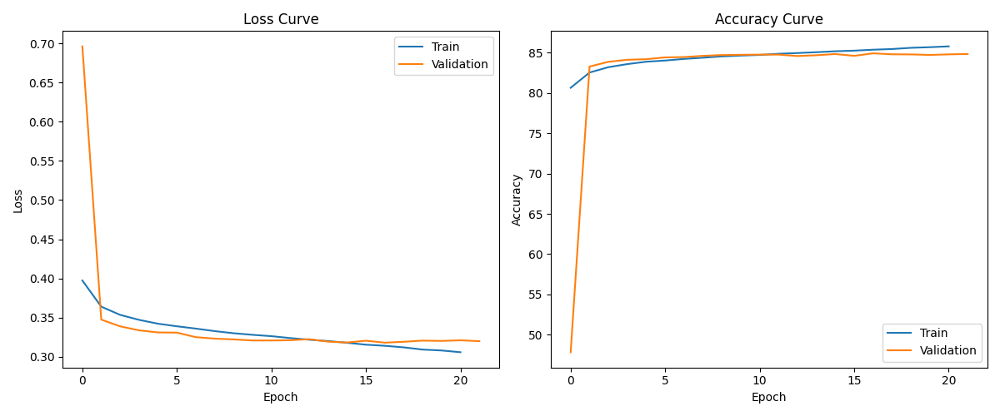

# 4ZP6A/B-capstone
McMaster University Capstone Project

Professor: Dr. Mehdi Moradi

Supervisor: Dr. Mehdi Moradi

Group members: Yuvraj Singh Sandhu, Suvansh Dutt, Suhaas Parcha, Ujjwal Raj

Mac ID: sandhy1, dutts1, parchas, raju1

Contact : **chestxraygrpacc@gmail.com** 

# Chest X-ray Analysis running 

## Overview
This project automates chest X-ray interpretation using AI and machine learning. The web interface is built with SvelteKit and Node.js, while the backend handles model training and inference.

## Frontend
- Built with **Node.js** and **SvelteKit**.
- Node v18+ required

### Setup  
1. Install dependencies:  
   ```sh
   npm install
   ```
2. Run the development server:
   ```sh
   npm run dev
   ```

### Directory Structure
```
src/               # Root directory for the frontend
│-- components/    # Contains the pages for the website
│-- routes/api/    # Contains the logic for API endpoints and nodes
│-- shared/        # Contains assets that are shared between components
```

### Test Account Credentials
To log in, click on the Login button and use the following credentials:

- **Email:** Test@gmail.com  
- **Password:** Test@123  

---

## Backend
- The backend/ folder contains the AI model and necessary configurations.
- **`backend/utility/CONFIG.py`** sets model parameters, including:
  - Epochs
  - Learning rate
  - Batch size
  - Training and validation size

### Running the Model
- Install dependencies using:
  ```sh
  pip install -r backend/requirements.txt
  ```
- Train and test the model by running:
  ```sh
  python backend/train.py
  ```
- The best pretrained model is located in:
  ```sh
  backend/model/
  ```
- **backend/Lightning_logs/** stores logs of past training attempts before achieving the best model.

## Model specifics  

Our AI was trained on the **Stanford CheXpert dataset**, which comprises a total of **224,316 chest radiographs** of **65,240 patients**. For more details on the dataset, please visit the [Stanford CheXpert website](https://stanfordmlgroup.github.io/competitions/chexpert/).


### Performance Metrics
- **AUROC:** 92%
- **Specificity:** 84%
- **Sensitivity:** 81%




---

## Notes
Ensure all dependencies are installed before running the application. Contact the team at **chestxraygrpacc@gmail.com** for additional support if needed.


